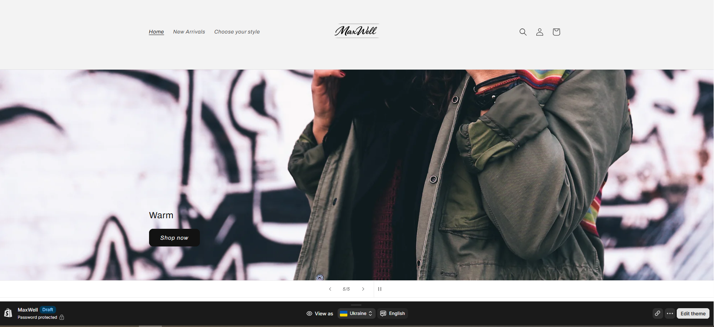
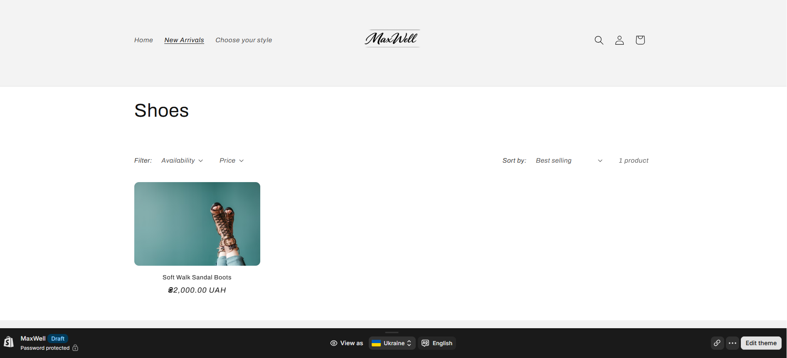
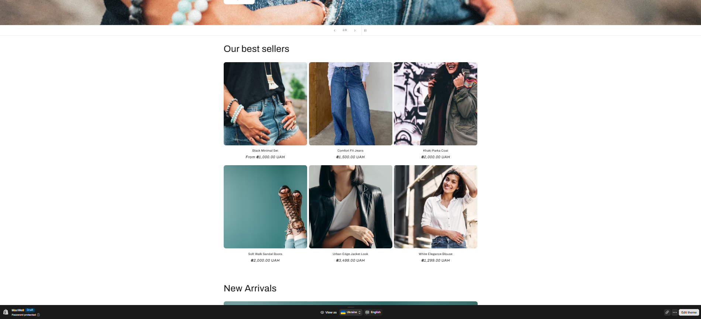
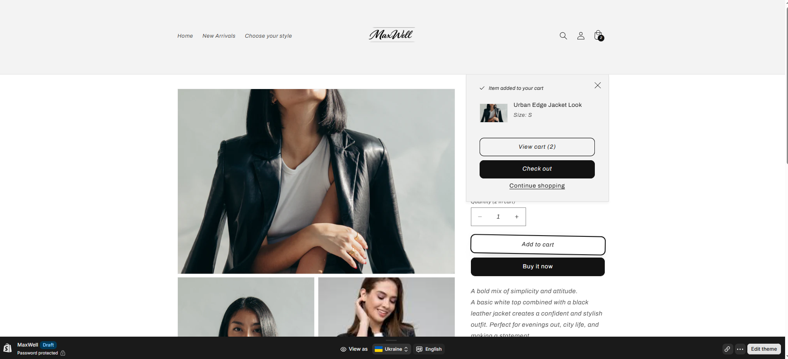
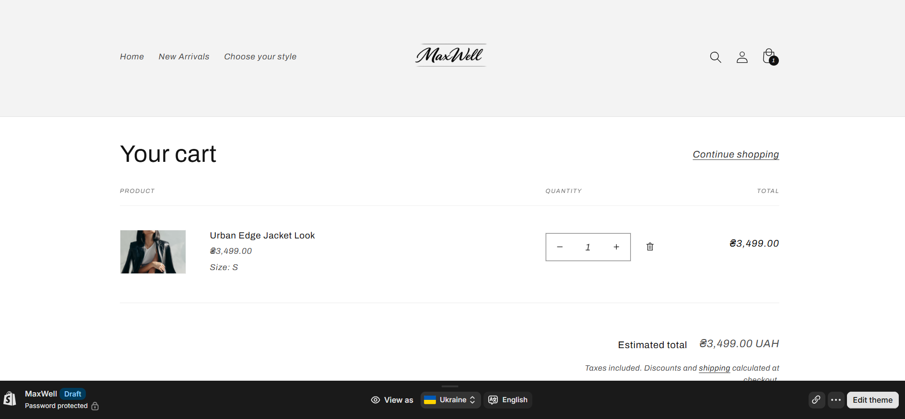
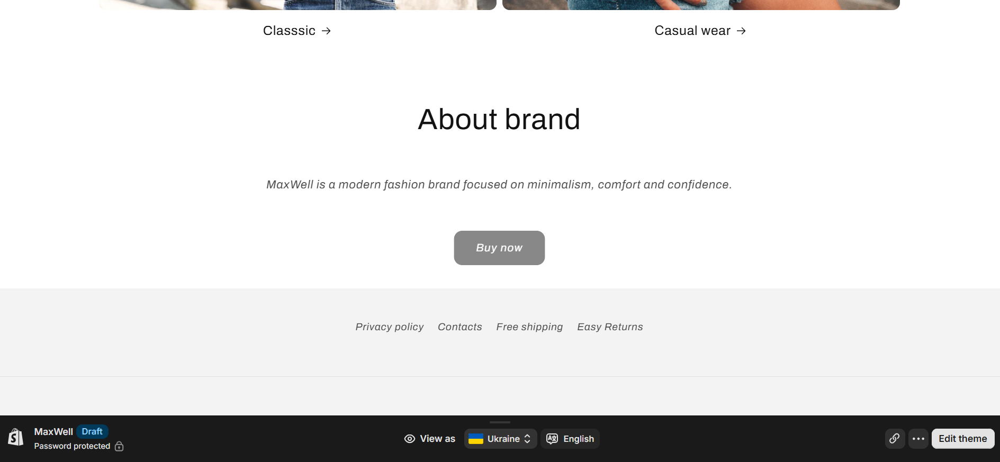
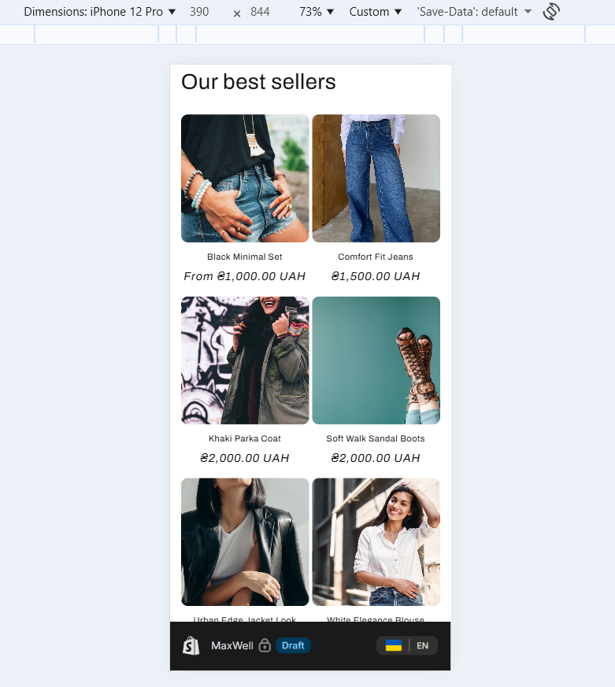

## 🖤 MaxWell — Shopify E-commerce Landing Page

E-commerce landing page for a modern fashion brand, built using Shopify.

The project focuses on clean design, product presentation, and a user-friendly structure aimed at improving conversion.

---

## 🔧 Technologies:
- Shopify (themes, sections, basic Liquid)
- HTML5 / CSS3
- JavaScript

---

## 🎯 What I did:
- Built landing page structure for a fashion e-commerce store
- Customized Shopify theme (sections, layout, content)
- Implemented responsive design (mobile-first approach)
- Created product-focused UI blocks
- Structured content for better user experience and readability

---

## 💡 Key focus:
- Clean and modern UI
- Mobile-first design
- E-commerce user flow
- Conversion-oriented layout

---

## 📸 Preview

### Desktop

### Mobile

---

## 🔗 Live Demo:
https://kvuui9-v5.myshopify.com/

---

## ⚠️ Note:
This project was developed using the Shopify platform for learning and portfolio purposes.
